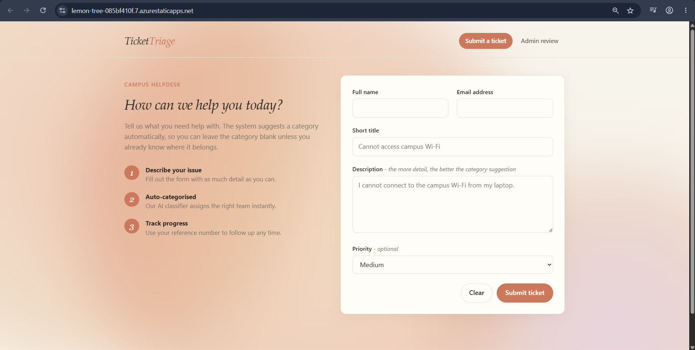
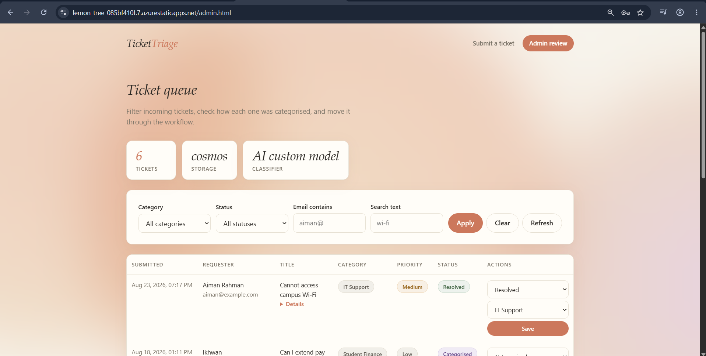

# Ticket Triage - AI Helpdesk Assistant

> **Note:** Built as a capstone project for the **MyMahir Full Stack Developer – Microsoft** program, organized by Knowledgecom and TalentCorp Malaysia.

---

Welcome to Group 1's **Ticket Triage** project! This application streamlines support workflows by automatically capturing, classifying, and routing tickets submitted by students and staff. Powered by AI and keyword-matching logic, all requests are securely persisted in **Azure Cosmos DB**, providing support administrators with a centralized dashboard to track and manage ticket lifecycles from submission to resolution.

---

## Key Features

* **Automated Ticket Classification:** Dynamically categorizes incoming support tickets using AI models and fallback keyword-matching logic.
* **Database Integration:** Seamlessly stores, queries, and updates ticket records using Azure Cosmos DB.
* **Admin Management Console:** Enables support staff to update ticket statuses, assign priorities, and manage overall lifecycle stages.

---

## Group 1 Contributors

* [@mkhikhwan](https://github.com/mkhikhwan)
* [@damienuwu](https://github.com/damienuwu)
* [@farhanazl](https://github.com/farhanazl)
* [@itsnotyourjay](https://github.com/itsnotyourjay)
* [@lawalah](https://github.com/lawalah)

---

## Documentation
* [Architecture Diagram](docs/architecture-diagram.pdf)
* [Azure Resource Group](docs/azure-rg.png)

---

## Contents

1. [Prerequisites](#1-prerequisites)
2. [Local Setup & Installation](#2-local-setup--installation)
3. [Running the Application Locally](#3-running-the-application-locally)
4. [Connecting to Live Cosmos DB (Local Testing)](#4-connecting-to-live-cosmos-db-local-testing)
5. [Connecting to Azure AI Language (Ticket Classification)](#5-connecting-to-azure-ai-language-ticket-classification)
6. [Running Unit Tests](#6-running-unit-tests)
7. [Step-by-Step Azure Deployment Guide](#7-step-by-step-azure-deployment-guide)
7. [Step-by-Step Azure Deployment Guide](#7-step-by-step-azure-deployment-guide)
8. [Screenshot](#8-screenshot)

---

## 1. Prerequisites

Before starting, ensure you have the following installed:

* **Git**
* **Python 3.11** or **Python 3.12**
* An active **Azure Account** (with student/free credits)

---

## 2. Local Setup & Installation

Follow these steps to set up your project environment:

### Step 1: Open the Terminal

Make sure you are in the target directory (without the hyphen):

```bash
cd tickettriage
```

### Step 2: Create a Virtual Environment

Create a localized Python environment:

```bash
python -m venv .venv
```

### Step 3: Activate the Virtual Environment

* **On Bash (Git Bash, WSL, Linux/macOS)**:

  ```bash
  source .venv/Scripts/activate
  ```

* **On PowerShell**:

  ```powershell
  .venv\Scripts\Activate.ps1
  ```

* **On Command Prompt (CMD)**:

  ```cmd
  .venv\Scripts\activate.bat
  ```

### Step 4: Install Dependencies

Install all required libraries and testing tools:

```bash
pip install -r requirements-dev.txt
```

---

## 3. Running the Application Locally

The repository contains a zero-dependency development server (`dev_server.py`) that hosts the static frontend and resolves the API endpoints.

### Step 1: Start the Server

With your virtual environment active, run:

```bash
python scripts/dev_server.py
```

### Step 2: Open in Browser

* **Frontend Ticket Form**: http://localhost:4280
* **Admin Dashboard**: http://localhost:4280/admin
* **API Health Check**: http://localhost:4280/api/health

### Step 3: Seed Sample Data

Open a second terminal window, navigate to `tickettriage`, activate the virtual environment, and run:

```bash
python scripts/seed_api.py
```

This loads 18 mock tickets to test the category classification model accuracy.

---

## 4. Connecting to Live Cosmos DB (Local Testing)

By default, the application runs in **in-memory** mode. To test it with your actual live Cosmos DB container:

### Step 1: Retrieve your Cosmos DB Connection String

1. Log into the [Azure Portal](https://portal.azure.com/).
2. Select your Cosmos DB Account.
3. Under **Settings → Keys**, copy the **PRIMARY CONNECTION STRING** (Do not copy the Primary Key; the connection string is much longer and starts with `AccountEndpoint=https://...`).

### Step 2: Create the Local Settings File

Create a new file at `api/local.settings.json` with this template:

```json
{
  "IsEncrypted": false,
  "Values": {
    "FUNCTIONS_WORKER_RUNTIME": "python",
    "AzureWebJobsStorage": "UseDevelopmentStorage=true",
    "CosmosDBConnectionString": "<paste-your-actual-cosmos-connection-string-here>",
    "COSMOS_DATABASE": "HelpdeskDB",
    "COSMOS_CONTAINER": "Tickets"
  },
  "Host": {
    "CORS": "*"
  }
}
```

*(Save the file. The development server will automatically detect and load these settings at startup).*

### Step 3: Run and Verify

Restart your development server (`python scripts/dev_server.py`). Open http://localhost:4280/api/health and verify that `"storage": "cosmos"` is shown.

---

## 5. Connecting to Azure AI Language (Ticket Classification)

By default, ticket classification falls back to the offline keyword-rules engine. To enable the trained AI classifier (Custom Text Classification) locally:

### Step 1: Retrieve the Language Resource Details

1. Log into the [Azure Portal](https://portal.azure.com/).
2. Select the team's Language resource (inside `rg-ai200-capstone`).
3. Under **Resource Management → Keys and Endpoint**, copy the **Endpoint** and **Key 1**.

### Step 2: Add to Your Local Settings File

Add these four values to your existing `api/local.settings.json` (the same file from Section 4):

```json
"LANGUAGE_ENDPOINT": "<paste-the-endpoint-url-here>",
"LANGUAGE_KEY": "<paste-key-1-here>",
"LANGUAGE_CTC_PROJECT": "TicketTriageClassifier",
"LANGUAGE_CTC_DEPLOYMENT": "production"
```

> [!NOTE]
>
> `LANGUAGE_CTC_PROJECT` and `LANGUAGE_CTC_DEPLOYMENT` should stay exactly as shown above — they identify the already-trained model deployed on the team's Language resource (trained on 399 example tickets, ~0.90 microF1). Do not rename these or retrain unless you know what you're doing: the Free tier only allows **1 hour of training time per month**. The setup script that created this model lives at `api/tools/setup_ctc_project.py`, with the training data at `data/ctc/out/labels.json`.

### Step 3: Run and Verify

Restart your development server (`python scripts/dev_server.py`). Submit a test ticket:

```bash
curl -X POST http://127.0.0.1:4280/api/tickets -H "Content-Type: application/json" -d "{\"name\":\"Test\",\"title\":\"wifi problem\",\"description\":\"cannot connect to campus wifi\",\"email\":\"test@student.edu\"}"
```

Check the response — `classificationMethod` should read `azure-ai-language-custom`, confirming the trained model is active. If it instead shows `azure-ai-language-keyphrase` or `keyword-rules`, double check your `LANGUAGE_KEY` value.

---

## 6. Running Unit Tests

To run the unit test suite:

```bash
pytest tests -v
```

> [!NOTE]
>
> **Windows Timer Resolution Warning:** If running on Windows, you may see 3 test failures (`test_timestamps_carry_sub_second_precision`, `test_listing_is_newest_first`, and `test_timestamps_are_distinct_for_rapid_inserts`). This is a known Windows limitation where the system clock's sub-second resolution (~15ms) causes rapid back-to-back dictionary insertions to resolve to duplicate timestamps. On Linux/macOS or in production, these tests pass cleanly.

---

## 7. Step-by-Step Azure Deployment Guide

To deploy the backend securely in production without hardcoding keys, implement the following steps:

### Step A: Configure Key Vault Secret

1. Open your Azure Key Vault `kv-capstone-db` (ensure it is configured on the **Standard** tier).
2. Go to **Objects → Secrets → Generate/Import**.
3. Create a secret named `CosmosDBConnectionString` and paste the connection string you retrieved from Cosmos DB.

### Step B: Enable Managed Identity on the Function App

1. Go to your Function App `func-ai200-triage-service`.
2. Ensure the plan is **Consumption (Y1)** for free-tier compliance.
3. Under **Settings → Identity**, toggle the Status to **On** under the **System assigned** tab, and save.

### Step C: Authorize the Function App in Key Vault

1. Go to your Key Vault `kv-capstone-db`.
2. Under **Settings → Access policies**, click **Create**.
3. Grant **Get** and **List** permissions for **Secret permissions**.
4. Search for and select your Function App identity (`func-ai200-triage-service`) as the principal, and save.

### Step D: Link Key Vault to App Settings

1. Go back to your Function App `func-ai200-triage-service`.
2. Under **Settings → Configuration → Application settings**, add a new setting:

   * **Name**: `CosmosDBConnectionString`
   * **Value**: `@Microsoft.KeyVault(VaultName=kv-capstone-db;SecretName=CosmosDBConnectionString)`
3. Save the configurations. Azure will automatically resolve the secret at runtime.

### Step E: Wire Up the AI Language Service (Same Pattern)

1. In `kv-capstone-db`, go to **Objects → Secrets → Generate/Import** and create a secret named `LanguageKey` containing the team's Language resource key.
2. Back in the Function App's **Application settings**, add:

   * **Name**: `LANGUAGE_KEY`
   * **Value**: `@Microsoft.KeyVault(VaultName=kv-capstone-db;SecretName=LanguageKey)`
3. Add these as plain (non-secret) Application settings, since they aren't sensitive:

   * `LANGUAGE_ENDPOINT` = the Language resource's endpoint URL
   * `LANGUAGE_CTC_PROJECT` = `TicketTriageClassifier`
   * `LANGUAGE_CTC_DEPLOYMENT` = `production`
4. Confirm the Function App's Managed Identity already has **Get**/**List** permission on `kv-capstone-db` (should already be set from Step C).

---

## 8. Screenshot


